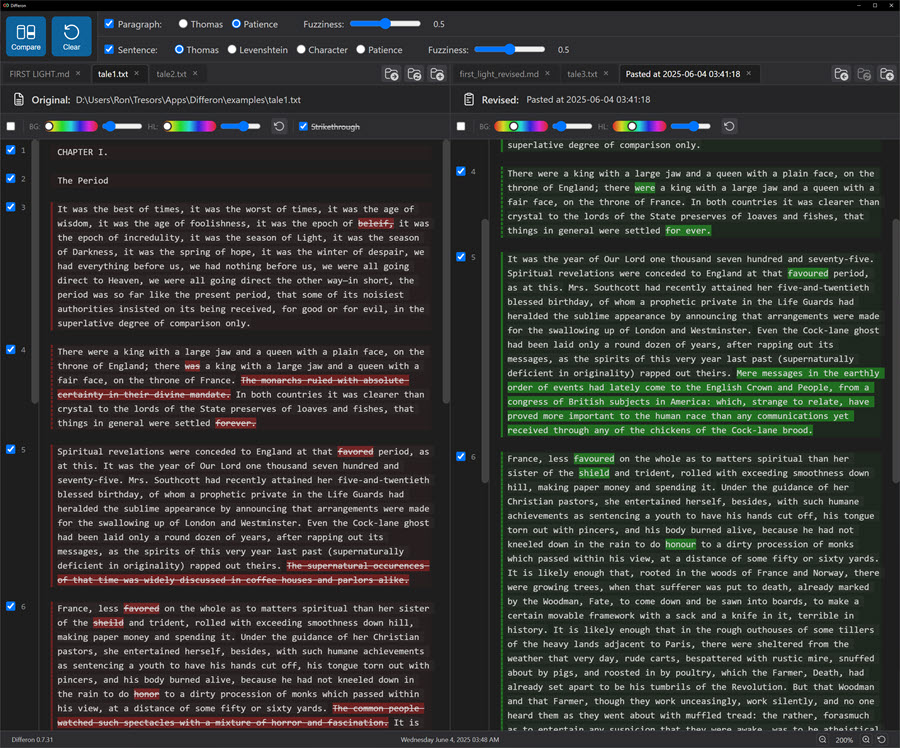
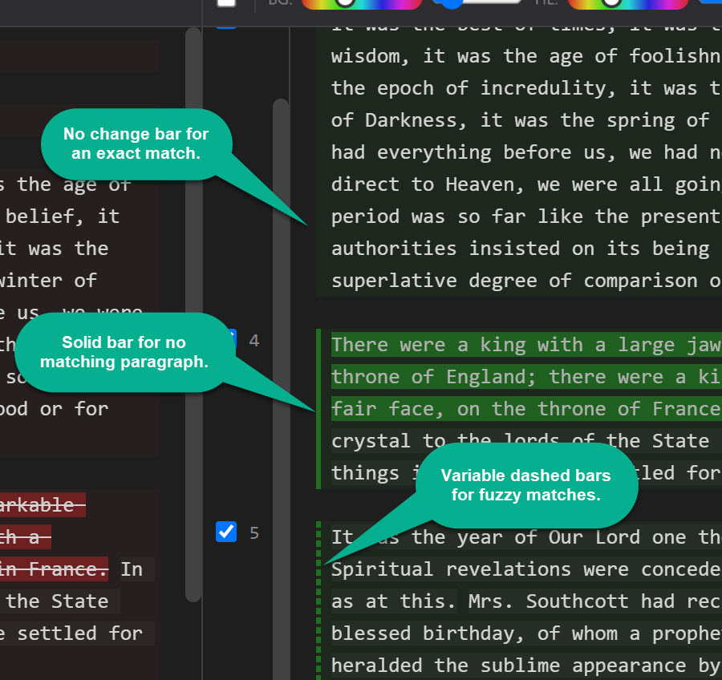
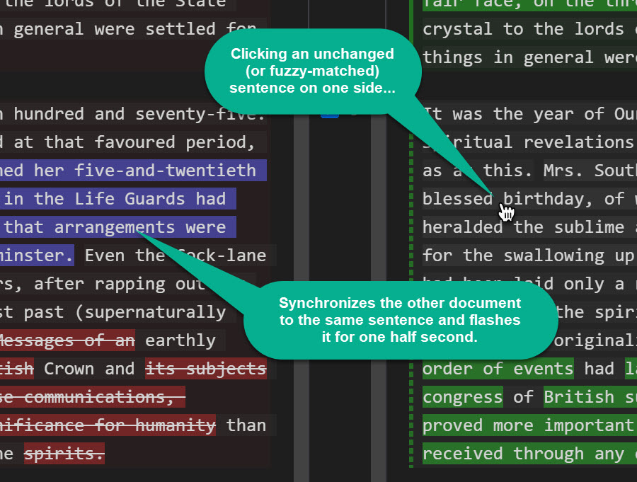

# Differon

<p align="center">
  
</p>

<p align="center">
  <strong>Smart text comparison designed for writers</strong>
</p>

<p align="center">
  <a href="https://wolfdenpublishing.github.io/differon/">Website</a> •
  <a href="https://wolfdenpublishing.github.io/differon/userguide.html">User Guide</a> •
  <a href="https://github.com/wolfdenpublishing/differon/releases/latest">Download</a>
</p>

---

Differon is a specialized file comparison tool designed specifically for comparing written text documents such as prose, articles, stories, and other natural language content. Unlike traditional diff tools that are optimized for source code, Differon uses natural language processing techniques to provide meaningful comparisons that respect the structure and flow of written text.

## ✨ Features

- **📝 Built for Writers** - Understands paragraphs and sentences, not just lines of code
- **🎯 Intelligent Comparison** - Advanced algorithms detect moved content and fuzzy match similar text
- **🖱️ Interactive Workflow** - Click-to-sync navigation and multi-tab support for efficient reviewing
- **🎨 Customizable** - Adjustable highlighting colors and fuzzy matching thresholds
- **📑 Multi-Document** - Compare up to 20 documents per side with drag-and-drop tab reordering
- **🔍 Two-Level Analysis** - Independent paragraph and sentence-level comparison
- **⚡ Real-time** - Manual comparison control for performance with large documents
- **🔓 Open Source** - Free to use, modify, and contribute

## 📸 Screenshots

### Main Interface

*The clean, dark-themed interface showing side-by-side document comparison*

### Paragraph-Level Changes

*Vertical change bars indicate modified paragraphs with fuzzy matching support*

### Sentence-Level Highlighting

*Detailed sentence-level comparison within changed paragraphs*

### Interactive Features

*Click any matched section to instantly sync both documents to that location*

## 🚀 Installation

### Quick Start (Recommended)

Download the latest release for your platform:

- **Windows**: [Download .exe installer](https://github.com/wolfdenpublishing/differon/releases/latest)
- **Linux**: [Download AppImage](https://github.com/wolfdenpublishing/differon/releases/latest) or [.deb package](https://github.com/wolfdenpublishing/differon/releases/latest)
- **macOS**: Coming soon

#### Windows Installation
1. Download the `.exe` installer
2. Run the installer (you may see a SmartScreen warning - click "More info" then "Run anyway")
3. Follow the installation wizard
4. Launch Differon from your Start Menu

#### Linux Installation (AppImage)
```bash
chmod +x Differon-*.AppImage
./Differon-*.AppImage
```

#### Linux Installation (Debian/Ubuntu)
```bash
sudo dpkg -i differon_*.deb
sudo apt-get install -f  # Install dependencies if needed
```

### Building from Source

#### Prerequisites
- Node.js (v14 or higher)
- npm (comes with Node.js)
- Git

#### Build Steps
```bash
# Clone the repository
git clone https://github.com/wolfdenpublishing/differon.git
cd differon

# Install dependencies
npm install

# Run the application
npm start

# Build for your platform
npm run build-win    # Windows
npm run build-mac    # macOS
npm run build-linux  # Linux
```

## 📖 Usage

1. **Load Documents**: Click the folder icons or drag files into the left and right panes
2. **Enable Comparison**: Check the boxes for paragraph and/or sentence comparison
3. **Compare**: Click the "Compare" button to analyze differences
4. **Navigate**: Click on any matched section to sync both documents
5. **Customize**: Adjust colors and fuzzy matching thresholds to your preference

### Key Features in Action

- **Fuzzy Matching**: Adjust sensitivity sliders to detect moved or slightly modified content
- **Multi-Tab Support**: Work with multiple document pairs simultaneously
- **Click-to-Copy**: Click any section to copy it (Ctrl+Click to append)
- **Real-time Editing**: Make changes directly in the application

For detailed instructions, see the [User Guide](https://wolfdenpublishing.github.io/differon/userguide.html).

## 📚 Documentation

- **[Official Website](https://wolfdenpublishing.github.io/differon/)** - Overview and downloads
- **[User Guide](https://wolfdenpublishing.github.io/differon/userguide.html)** - Comprehensive documentation
- **[Example Files](examples/)** - Sample documents to try with Differon

## 🤝 Contributing

Contributions are welcome! Here's how you can help:

1. **Report Issues**: [Open an issue](https://github.com/wolfdenpublishing/differon/issues) for bugs or feature requests
2. **Submit PRs**: Fork the repo and submit pull requests for improvements
3. **Documentation**: Help improve the user guide or add examples
4. **Testing**: Test on different platforms and report compatibility issues

## 🛠️ Technical Details

Differon is built with:
- **Electron** - Cross-platform desktop application framework
- **Node.js** - JavaScript runtime
- **Custom diff algorithms** - Optimized for natural language comparison

The modular architecture supports multiple diff algorithms:
- **Thomas Algorithm** - Sequential matching for ordered content
- **Patience Algorithm** - Structural matching for reorganized content

## 📄 License

This project is licensed under the MIT License - see the [LICENSE](LICENSE) file for details.

## 👤 Author

**Ron Thomas**  
Email: ron@wolfden.pub  
GitHub: [@wolfdenpublishing](https://github.com/wolfdenpublishing)

---

<p align="center">
  Made with ❤️ for writers who care about their words
</p>